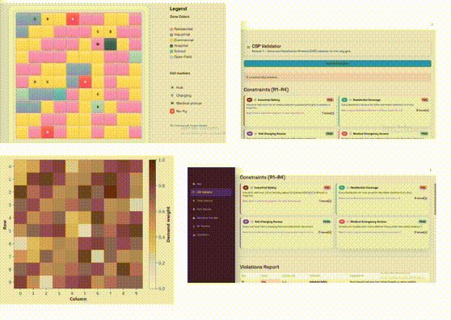

# AeroNet Lite

A simulation of an autonomous drone delivery system built on a 10x10 city grid. The system validates city layouts, selects drone fleets, plans delivery routes, handles disruptions in real time, forecasts demand, and detects flight anomalies.



---

## What This Project Does

AeroNet Lite simulates how a fleet of drones would operate in a small city. The city is represented as a 10x10 grid where each cell has a zone type, population density, and delivery demand. Over 20 simulation steps, drones pick up and drop off deliveries, avoid restricted zones, and adapt if those zones change mid-flight.

The system is split into five modules that work together:

- **Grid and layout validation** — defines the city and checks that it follows the rules before the simulation starts
- **Fleet selection** — picks the right mix of drones within a budget
- **Route planning** — finds the best path for each drone and reroutes them if a zone is blocked mid-flight
- **ML pipeline** — predicts how much demand there will be each hour and flags drones behaving abnormally
- **Visualization and integration** — displays the grid, routes, and heatmaps, and ties all the modules together

---

## Project Structure

```
aeronet_lite/
  data/
    raw/              # Original datasets (not tracked by git, download separately)
    processed/        # Trained model files saved here after running notebooks
  src/
    grid_model.py         # 10x10 grid data model
    layout_validator.py   # Checks the city layout against constraints
    fleet_selector.py     # Selects which drones to use
    astar_planner.py      # Plans delivery routes using A*
    delivery_simulator.py # Runs the 20-step simulation
    ml_pipeline.py        # Demand forecasting and anomaly detection
    visualization.py      # Grid, route, and heatmap rendering
    main.py               # Run this to start the simulation
  notebooks/
    demand_forecasting.ipynb    # Train the demand forecast model
    anomaly_classifier.ipynb    # Train the anomaly detection model
  report/
    figures/
    final_report.docx
  requirements.txt
  README.md
```

---

## Setup

Make sure you have Python installed, then run the following:

```bash
git clone <repo-url>
cd aeronet_lite
python -m venv venv

# Activate the virtual environment
venv\Scripts\activate       # Windows
source venv/bin/activate    # Mac / Linux

pip install -r requirements.txt
```

---

## Before Running the Simulation

The ML pipeline needs trained model files to work. You have to run the two notebooks first, in order.

### Step 1 — Train the demand forecast model

Open `notebooks/demand_forecasting.ipynb` and run all cells.

This notebook requires the Kaggle Bike Sharing Demand dataset. Download `train.csv` from Kaggle and place it at:

```
data/raw/bike-sharing/train.csv
```

When the notebook finishes, it saves these files to `data/processed/`:

- `demand_model.pkl`
- `demand_scaler.pkl`

### Step 2 — Train the anomaly detection model

Open `notebooks/anomaly_classifier.ipynb` and run all cells.

This notebook generates its own synthetic data, so you do not need to download anything. When it finishes, it saves:

- `anomaly_model.pkl`
- `anomaly_scaler.pkl`
- `anomaly_label_encoder.pkl`

### Step 3 — Check that the pipeline is working

```bash
cd src
python ml_pipeline.py
```

All status checks should say Yes and all self-tests should pass. If anything fails, make sure the `.pkl` files exist in `data/processed/`.

---

## Running the Simulation

Once the models are trained:

```bash
cd src
python main.py
```

This runs the full 20-step simulation. You will see the drone routes, demand heatmap, and anomaly log rendered on the grid.

---

## Using the ML Pipeline in Your Own Code

If you want to call the ML functions from another module:

```python
from ml_pipeline import get_demand_forecast, detect_anomaly, get_grid_demand, assign_demand_to_grid

# Predict delivery demand for a given hour
demand = get_demand_forecast(hour=8, season=2, workingday=1, weather=1)

# Check whether a drone's telemetry looks normal
result = detect_anomaly(battery_drop=35.0, route_deviation=1.0)
print(result['label'], result['is_anomaly'])

# Fill the full grid with demand values for a given hour
grid = assign_demand_to_grid(grid, hour=14, season=2)
```

The four anomaly labels the classifier can return are: Normal, Battery Anomaly, Route Anomaly, and Sensor Spike.

---

## Datasets

| Purpose | Source |
|---|---|
| Demand forecasting | Kaggle — Bike Sharing Demand (`train.csv`) |
| Anomaly detection | Synthetic data generated inside the notebook |

Raw data files are not tracked by git. Each team member downloads their own copy and places it in `data/raw/`.

---

## Module Ownership

| Member | Module |
|---|---|
| 1 | Grid model and CSP layout validator |
| 2 | Fleet selector |
| 3 | A* path planner and disruption handler |
| 4 | ML pipeline |
| 5 | Visualization and integration |

---

By: 
Aleesha,Wajeeha,Tayyaba,Hadia,Areeba <3

